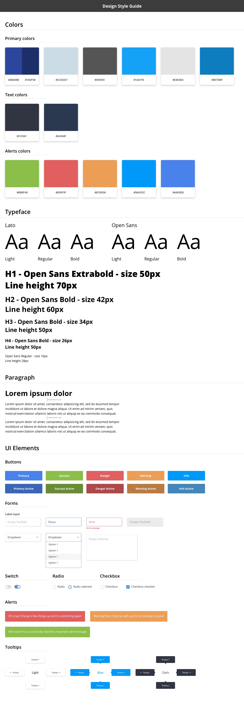

# :pencil2: Basic Design Style Guide

⚡️ A simple design style guide using SketchApp to use in your layouts

## Preview Style Guide

  

## Get Started

* Install `Open Sans Font`. You can find fonts in `fonts/`;
* Download project [here](https://github.com/helderburato/design-styleguide/archive/master.zip).

## Contributing

Please read [CONTRIBUTING.md](CONTRIBUTING.md) for details on our code of conduct, and the process for submitting pull requests to us.

## Versioning

We use [SemVer](http://semver.org/) for versioning. For the versions available, see the [tags on this repository](https://github.com/helderburato/design-styleguide/tags). 

## Author

[Helder Burato Berto](https://github.com/helderburato).

## License

This project is licensed under the MIT License - see the [LICENSE](LICENSE) file for details.